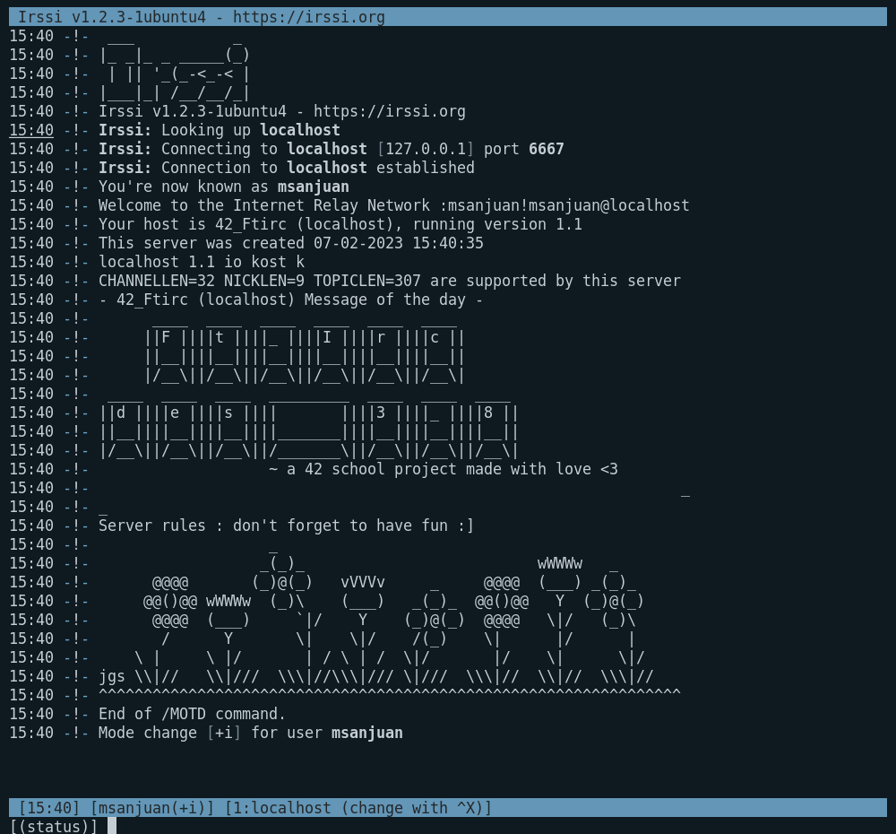
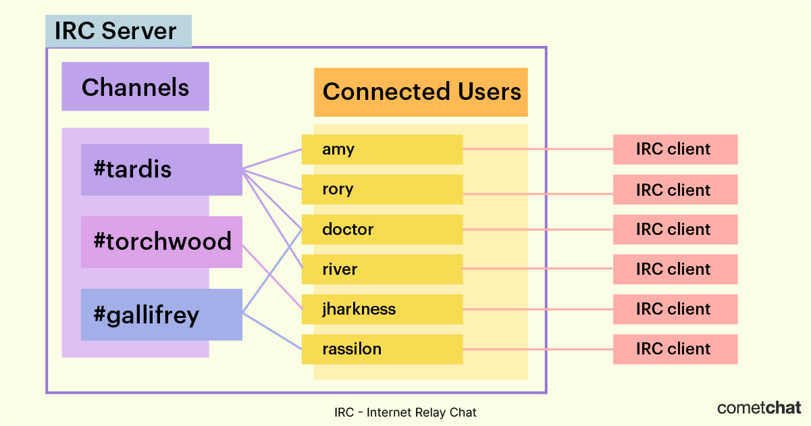
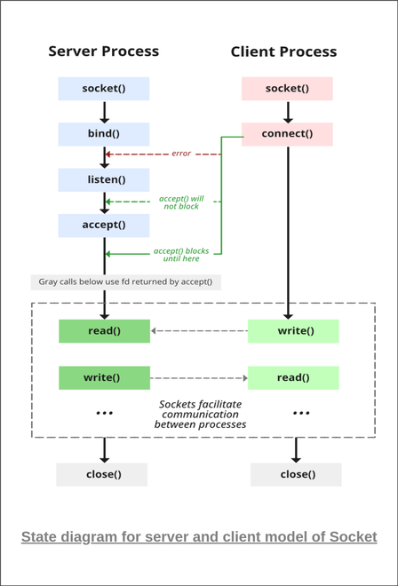

# :zap: FT_IRC :zap:

<p align="center">   </p>


##### *Proudly coded by [@tmanolis](https://github.com/tmanolis), [@QnYosa](https://github.com/QnYosa) and @marineks :heart:*

___

## :dizzy: Summary

1. [About the project](https://github.com/marineks/Ft_irc#school_satchel-about-this-project)
* [Definition](https://github.com/marineks/Ft_irc#_-crystal_ball-definition)
* [Subject requirements](https://github.com/marineks/Ft_irc#_-floppy_disk-subject-requirements)
* [Commands that we implemented](https://github.com/marineks/Ft_irc#high_brightness-commands-that-we-implemented-)
2. [Some tips, graphs and other ressources](https://github.com/marineks/Ft_irc#gift-some-tips-graphs-and-other-ressources)
* [Helpful links](https://github.com/marineks/Ft_irc#_-books-helpful-links)
* [Tips](https://github.com/marineks/Ft_irc#_-books-helpful-links)
___
## :school_satchel: About this project


The objective of this project is to reproduce the functioning of an IRC server.

###  _ :crystal_ball: Definition


> "IRC (Internet Relay Chat) is a **protocol for real-time text messaging between internet-connected computers created in 1988**. It is mainly used for group discussion in chat rooms called “channels” although it supports private messages between two users, data transfer, and various server-side and client-side commands. As of April 2011, the top 100 IRC networks served over 500,000 users at a time on hundreds of thousands of channels." ([source](https://www.radware.com/security/ddos-knowledge-center/ddospedia/irc-internet-relay-chat/))



### _ :floppy_disk: Subject requirements


**1.** Code the IRC server in C++98
**2.** Your binary should look like this : `./ircserv <port> <password>`
**3.** You should use `poll()` and only **once**.
**4.** The client/server communication will be TCP/IP (v4 or v6)
**5.** The following features are mandatory :
> **i)** You should be able to register, i.e to define a nickname, a username

> **ii)** You should be able to join a channel, send or receive private messages

> **iii)** Every message sent by a client in a channel must be received by all of the clients who have joined this channel

> **iv)** You should have normal users and operators, and implement the operators' specific commands
**6.** No leaks (even still reachables) and handle the signals (partial messages with `CTRL+D`, suspended process with `CTRL+Z`, and obviously SIGINT (`CTRL+C`))
**7.** (bonuses) implement a bot + file transfer.


___
### :high_brightness: Commands that we implemented :


| Command | Description |
| :-----------: | :----------- |
| Invite | The `INVITE` command is used to invite a user to a channel. |
| Join | The `JOIN` command indicates that the client wants to join the given channel(s), each channel using the given key for it. |
| Kick | The `KICK` command can be used to request the forced removal of a user from a channel. |
| Kill | The `KILL` command is used to close the connection between a given client and the server they are connected to. `KILL` is a privileged command and is available only to IRC Operators. |
| List | The `LIST` command is used to get a list of channels along with some information about each channel. |
| Mode | The `MODE` command is used to set or remove options (or modes) from a given target. Our user modes : i, o. Our channels modes: b,k,m,o,p,s,t,v |
| Motd | The `MOTD` command is used to get the “Message of the Day” of the given server. |
| Names | The `NAMES` command is used to view the nicknames joined to a channel and their channel membership prefixes. |
| Nick | The `NICK` command is used to give the client a nickname or change the previous one. |
| Notice | The `NOTICE` command is used to send notices between users, as well as to send notices to channels. The difference between `NOTICE` and `PRIVMSG` is that automatic replies must never be sent in response to a `NOTICE` message.  |
| Oper | The `OPER` command is used by a normal user to obtain IRC operator privileges.  |
| Part | The `PART` command removes the client from the given channel(s). |
| Pass | The `PASS` command is used to set a ‘connection password’. If set, the password must be set before any attempt to register the connection is made. |
| Ping | The `PING` command is sent by either clients or servers to check the other side of the connection is still connected and/or to check for connection latency, at the application layer. |
| Privmsg | The `PRIVMSG` command is used to send private messages between users, as well as to send messages to channels. |
| Quit | The `QUIT` command is used to terminate a client’s connection to the server. The server acknowledges this by replying with an `ERROR` message and closing the connection to the client. |
| Topic | The `TOPIC` command is used to change or view the topic of the given channel. |
| User | The `USER` command is used at the beginning of a connection to specify the username and realname of a new user. |

## :gift: Some tips, graphs and other ressources


### _ :books: Helpful links


- **To understand what exactly is an IRC and begin the project** : [Chirc](http://chi.cs.uchicago.edu/chirc/irc.html) (An irc subject from a Chicago uni) and the next pages too.


- **Regarding the client/server connection** : [Beej's Guide to network programming](https://beej.us/guide/bgnet/pdf/bgnet_a4_c_1.pdf). This is super super helpful to better understand what is a socket, what the `poll()` function entails, which system calls we should use or in which order, and so on.


<p align="center">  </p>

- **A link to the IRC Client Protocol with a good formatting** : [Modern IRC Client Protocol](https://modern.ircdocs.horse/). You will find there a description of all the commands with correct syntax, expected Numerical Replies,...


### _ :mailbox: Tips


- **A suggestion of project roadmap :** 
  1- Begin by establishing a working client/server socket connection, 
  2- Then build on that : add the signals handling (`CTRL+C`, `CTRL+D`, `CTRL+Z`);
   3- ***Only*** then begin the client registration system (`NICK`, `USER`, `PASS`), 
   4- The server commands (`PING`, `OPER`, `KILL`...) and 
   5- The channel operations commands (`JOIN`, `PART`, `INVITE`, `KICK`, `PRIVMSG`, `NOTICE`...).


	___

- **Help, my code works perfectly with irssi but not with nc!** If you have this kind of issue, this is because, like us, you made the mistake of coding with irssi first and not nc :grimacing: Keep in mind that nc is very "minimalist" compared to irssi. That means that irssi will send you everything at once : the command, and the CRLF ending (`\r\n`). It will also append the `:` in some cases (for instance `TOPIC #channel :message`).


  *This is not the case with nc* : you will have to concatenate the messages sent by the Client until you find the proper "end" (the CRLF). **That means that you should have a (read) buffer ==for each client== connected to your server**. Bonus: this will take care of he `CTRL+D` signal too! :smirk:


  So now, if you follow us, you should guess that, for each client, **you will need a (send) buffer as well**! This will be very efficient in taking care of the `CTRL+Z` signal :innocent: . Don't forget to also check the `POLLIN and POLLOUT revents` in your server loop...

	___

- **How to know how to correctly format a RPL to be understood by your IRC client of reference** (for instance, irssi) ?
  .
  
  Join an existing server (try `/connect DALNET`), then enter the command `/RAWLOG OPEN debug.log` [(more doc)](https://irssi.org/documentation/help/rawlog/), and try the commands you're having some troubles with. This will open a log file in your workspace containing the all the exact client/server interactions for these commands, such as :
	```c
	// [...]
	<< JOIN #help // from the client
	>> :nickname!username@host JOIN :#help // reply from the server
	// [...]
	```
  Voilà ! Now you know you forgot the `:` before the channel name! ;)

	___
- **Okay, now you have a good format but the code is not clean at all?** Try to use dynamic macros in this way (*we guarantee this is a life changer/saver!*) :
  ```cpp
	#define user_id(nickname, username) (":" + nickname + "!" + username + "@localhost")
	#define RPL_INVITE(user_id, invited, channel) (user_id + " INVITE " + invited + " #" + channel + "\r\n")
	// [...]
	#define ERR_INVALIDMODEPARAM(client, channel, mode, password) ("696 " + client + " #" + channel + " " + mode + " " + password + " : password must only contained alphabetic character\r\n")
  ```
